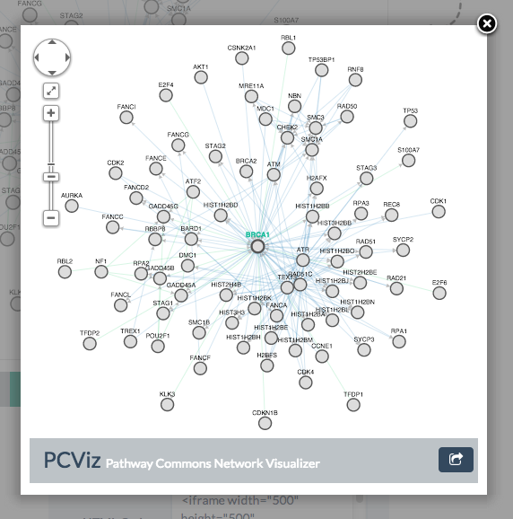

# biojs-pcviz

[](https://www.npmjs.org/package/biojs-pcviz) 
[](http://travis-ci.org/PathwayCommons/biojs-pcviz) 

> BioJS component for PCViz embedded widget

## About
[PCViz](http://www.pathwaycommons.org/pcviz/) is a web-based binary interaction visualizer that pulls in data from [Pathway Commons](http://www.pathwaycommons.org/about).
PCViz has an embedded widget option that can be used by other developers to easily show network on their web sites.
This module wraps this functionality around BioJS framework for better and easier integration by developers.



Here some useful PCViz links:
- *PCViz Homepage*: http://www.pathwaycommons.org/pcviz
- *PCViz on BioJS Registry*: http://biojs.io/d/biojs-pcviz
- *Pathway Commons*: http://www.pathwaycommons.org/about/

## Getting Started
Install the module with: `npm install biojs-pcviz`

or you can use the browser version from the latest build:

https://github.com/PathwayCommons/biojs-pcviz/tree/master/build

The following code sample shows how to use this component in a simple way:

```javascript
var biojspcviz = require('biojs-pcviz');

// Create an instance of PCViz
var pcviz = new biojspcviz();

// Visualize the neighborhood of "BRCA1" gene in a div using this new instance
pcviz.neighborhood({ el: '#yourDivId', query: "BRCA1"}); 
```

You can find more examples under the `examples` folder:

https://github.com/PathwayCommons/biojs-pcviz/tree/master/examples

## Documentation

### Default Options for Queries

```javascript
var opts = {
	// Target HTML element
	el: document.createElement("div"),
	// Base URL for the target PCViz instance
	baseurl: "http://www.pathwaycommons.org/pcviz/",
	// Width of the iframe
	width: "100%",
	// Height of the iframe
	height: "100%",
	// Query gene(s); delimited by comma (",") if more than one
	query: "MDM2",
	// If PCViz doesn't get loaded in this time, onFail will be called
	timeout: 20 * 1000,
	// Callback function for network load event
	onLoad: function(msg) {},
	// Callback function for node clicks; msg contains information about the node
	onNodeClick: function(msg) {},
	// Callback function for edge clicks; msg contains information about the edge
	onEdgeClick: function(msg) {},
	// Callback function for background clicks; msg containts no information
	onBackgroundClick: function(msg) {},
	// Callback function to be called if network doesn't get loaded in timeout miliseconds.
	onFail: function() {}
}
```

#### .neighboorhood(opts)

**Parameter**: `opts`
**Type**: `Object`
**Example**: `{el: ..., query: ...}`

Visualizes the neighborhood of all `query` genes.

Example:
```javascript
// Loads neighborhood of BRCA2
pcviz.neighborhood({ el: thatEl, query: "BRCA2"});
```

#### .pathsbetween(opts)

**Parameter**: `opts`
**Type**: `Object`
**Example**: `{el: ..., query: ...}`

Queries the path between two or more genes.
Returns a less dense network compared to `neighborhood`.

Example:
```javascript
// Loads paths between TP53,MDM2
pcviz.pathsbetween({ el: thatEl, query: "TP53,MDM2"});
```

## Contributing

Please submit all issues and pull requests to the [PathwayCommons/biojs-pcviz](http://github.com/PathwayCommons/biojs-pcviz) repository!

## Support
If you have any problem or suggestion please open an issue [here](https://github.com/PathwayCommons/biojs-pcviz/issues).

## License 
This program is free software: you can redistribute it and/or modify it under the terms of the GNU Lesser General Public License as published by the Free Software Foundation, either version 3 of the License, or (at your option) any later version.

This program is distributed in the hope that it will be useful, but WITHOUT ANY WARRANTY; without even the implied warranty of MERCHANTABILITY or FITNESS FOR A PARTICULAR PURPOSE. See the GNU Lesser General Public License for more details.

You should have received a copy of the GNU Lesser General Public License along with this program. If not, see http://www.gnu.org/licenses/.
